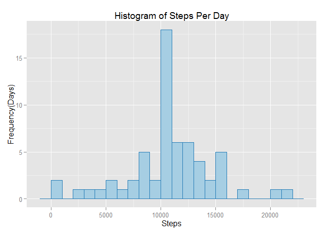

# PA1_template
Ryan Bechtel  
November 15, 2015  

#Preparing R Enrvironment
The following loads the necessary libraries: dplyr, ggplot, etc. and setups the working directory for the analysis.

```r
library(dplyr)
```

```
## 
## Attaching package: 'dplyr'
## 
## The following objects are masked from 'package:stats':
## 
##     filter, lag
## 
## The following objects are masked from 'package:base':
## 
##     intersect, setdiff, setequal, union
```

```r
library(ggplot2)
#set working directory
setwd("C:/Users/rbechtel/Dropbox/Coursera/5_Reproducible_Research/PA1/RepData_PeerAssessment1")
```

#Loading and Processing the Data
The following imports the raw data.

```r
#import raw data file
activity <- read.csv("activity.csv"
                     ,stringsAsFactors = FALSE)
```

#What is the mean total number of steps taken per day?
The following produces a histrogram demonstrating the distribution of steps taken per day. Then the mean and meadian steps/day are provided. 

```r
#calculate the total steps per day and exclude NA
daily_totals <- activity %>%
                        filter(!is.na(steps)) %>%
                        group_by(date) %>%
                        summarize(steps_per_day = sum(steps))

#create histogram
qplot(daily_totals$steps_per_day,geom = "histogram"
                                ,xlab = "Steps"
                                ,ylab = "Frequency(Days)"
                                ,main = "Histogram of Steps Per Day"
                                ,binwidth = 1000
                                ,fill = I("#a6cee3")
                                ,col = I("#1f78b4"))
```

 

```r
#compute mean and median values
mean_steps <- mean(daily_totals$steps_per_day)
median_steps <- median(daily_totals$steps_per_day)

#print mean and median values
print(paste0("The mean number of steps per day is: ",mean_steps))
```

```
## [1] "The mean number of steps per day is: 10766.1886792453"
```

```r
print(paste0("The median number of steps per day is: ",median_steps))
```

```
## [1] "The median number of steps per day is: 10765"
```

#What is the average daily activity pattern?
Produces a time-series plot of the 5-minute intervals average across all days.

```r
#calculate the average steps per interval and exclude NA
interval_avgs <- activity %>%
                        filter(!is.na(steps)) %>%
                        group_by(interval) %>%
                        summarize(avg_steps = mean(steps))

#create time-series plot of 5-minute intervals
qplot(data =  interval_avgs
             ,x = interval
             ,y = avg_steps
             ,xlab = "5 Minute Interval"
             ,ylab = "Average Steps"
             ,geom = "line")
```

 

```r
#compute the interval that has the max number of steps
max_interval <- interval_avgs[which.max(interval_avgs$avg_steps),1]

#print the max interval
print(paste0("The 5-minute interval with the most steps is: ",max_interval))
```

```
## [1] "The 5-minute interval with the most steps is: 835"
```

#Imputing Missing Values
The following finds the number of records that have missing values. Then replaces those missing values with the mean for the corresponding interval. Finally, the code plots a histogram of the revised data and determines the mean and median values.

```r
#Compute and report the number of missing values in the data
missing_values<- sum(is.na(activity$steps))
print(paste0("The number of rows with missing values is: ",missing_values))
```

```
## [1] "The number of rows with missing values is: 2304"
```

```r
#calculate the total steps per interval and exclude NA
interval_avgs <- activity %>%
                        filter(!is.na(steps)) %>%
                        group_by(interval) %>%
                        summarize(avg_steps = mean(steps))

#join daily averages to raw data
activity_rev <- left_join(activity, interval_avgs, by = "interval")

#if steps is NA replace with average per interval, otherwise use steps. Values stores in new column: steps_rev.
activity_rev$steps_rev <- with(activity_rev, ifelse(is.na(activity_rev$steps),avg_steps,steps))

#calculate the total steps per day AFTER replacing NA's
daily_totals_rev <- activity_rev %>%
                        group_by(date) %>%
                        summarize(steps_per_day = sum(steps_rev))

#create histogram AFTER replacing NA's
qplot(daily_totals_rev$steps_per_day,geom = "histogram"
                                ,xlab = "Steps"
                                ,ylab = "Frequency(Days)"
                                ,main = "Histogram of Steps Per Day"
                                ,binwidth = 1000
                                ,fill = I("#a6cee3")
                                ,col = I("#1f78b4"))
```

 

```r
#compute mean and median values
mean_steps <- mean(daily_totals_rev$steps_per_day)
median_steps <- median(daily_totals_rev$steps_per_day)


#print mean and median values
print(paste0("The mean number of steps per day is: ",mean_steps))
```

```
## [1] "The mean number of steps per day is: 10766.1886792453"
```

```r
print(paste0("The median number of steps per day is: ",median_steps))
```

```
## [1] "The median number of steps per day is: 10766.1886792453"
```

#Are there differences in activity patterns between weekdays and weekends?
The following code plots the average daily activity for each 5 minute interval. In this version, the data is separated by weekend and weekdays and in the final plot, the two periods are shown separately. 

```r
#convert class of date field to "date"
activity$date <- as.Date(activity$date, format = "%Y-%m-%d")

#calculate day of week for each date
activity$weekday <- weekdays(activity$date)
#determine if each day is a weekday or weekend
activity$weekday_status <- with(activity, ifelse(weekdays(date) %in% c("Sunday","Saturday"),"Weekend","Weekday"))

#calculate the average steps by weekday and interval and exclude NA
interval_avgs <- activity %>%
                        filter(!is.na(steps)) %>%
                        group_by(interval, weekday_status) %>%
                        summarize(avg_steps = mean(steps))

#create time-series plot of 5-minute intervals facetted by weekday/weekend
qplot(data =  interval_avgs
             ,x = interval
             ,y = avg_steps
             ,xlab = "5 Minute Interval"
             ,facets = weekday_status~.
             ,ylab = "Average Steps"
             ,geom = "line")
```

 


